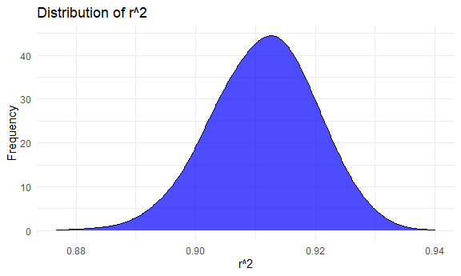
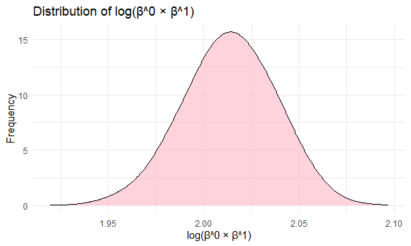
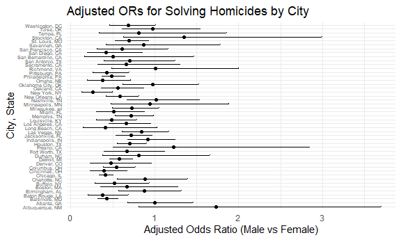
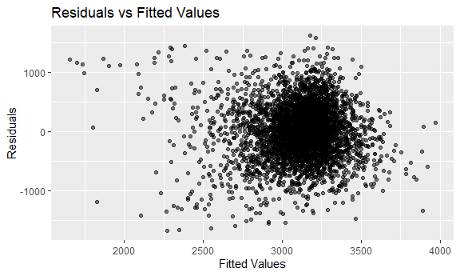

p8105_hw6_yf2735
================
Yujing FU
2024-12-02

### Problem 1

``` r
weather_df = 
  rnoaa::meteo_pull_monitors(
    c("USW00094728"),
    var = c("PRCP", "TMIN", "TMAX"), 
    date_min = "2017-01-01",
    date_max = "2017-12-31") %>%
  mutate(
    name = recode(id, USW00094728 = "CentralPark_NY"),
    tmin = tmin / 10,
    tmax = tmax / 10) %>%
  select(name, id, everything())
```

    ## Registered S3 method overwritten by 'hoardr':
    ##   method           from
    ##   print.cache_info httr

    ## using cached file: C:\Users\Persica\AppData\Local/R/cache/R/rnoaa/noaa_ghcnd/USW00094728.dly

    ## date created (size, mb): 2024-09-26 10:06:44.050585 (8.668)

    ## file min/max dates: 1869-01-01 / 2024-09-30

``` r
# bootstrap
set.seed(11)
n_sample = 5000

# bootstrap model
bootstrap_results = replicate(n_sample, {
  boot_sample = weather_df  |>  slice_sample(n = nrow(weather_df), replace = TRUE)
  
  # LR model
  fit = lm(tmax ~ tmin, data = boot_sample)
  
  r2 = glance(fit)$r.squared
  coefs = tidy(fit) |>  pull(estimate)
  log_beta_prod = log(coefs[1] * coefs[2])
  
  # return results
  c(r2 = r2, log_beta_prod = log_beta_prod)
}, simplify = TRUE)  |>  t() |>  as.data.frame()

# name results
colnames(bootstrap_results) = c("r2", "log_beta_prod")

# plot
p1 = ggplot(bootstrap_results, aes(x = r2)) +
  geom_density(fill = "blue", alpha = 0.7, adjust = 2) +
  theme_minimal() +
  labs(title = "Distribution of r^2", x = "r^2", y = "Frequency")

p2 = ggplot(bootstrap_results, aes(x = log_beta_prod)) +
  geom_density(fill = "pink", alpha = 0.7, adjust = 2) +
  theme_minimal() +
  labs(title = "Distribution of log(β^0 × β^1)", x = "log(β^0 × β^1)", y = "Frequency")

p1
```



``` r
p2
```



``` r
# 95% confidence interval
ci_r2 = quantile(bootstrap_results$r2, probs = c(0.025, 0.975))
ci_log_beta_prod = quantile(bootstrap_results$log_beta_prod, probs = c(0.025, 0.975))

list(
  ci_r2 = ci_r2,
  ci_log_beta_prod = ci_log_beta_prod)
```

    ## $ci_r2
    ##      2.5%     97.5% 
    ## 0.8938394 0.9272746 
    ## 
    ## $ci_log_beta_prod
    ##     2.5%    97.5% 
    ## 1.964577 2.059025

The blue plot shows a smooth density curve for the `r2`, which is
unimodal and slightly left-skewed, with most values concentrated between
approximately 0.89 and 0.93. The peak is around 0.91, indicating that
most samples have R squared value around 0.91. This means the model can
explain the relationship bewteen `tmax` and `tmin` quite well. The 95%
confidence interval for `r2` is \[0.8938394, 0.9272746\].

The pink plot shows a density curve for `log_beta_prod`, which is
unimodal and symmetric, centered around a mean of approximately 2.02.
The 95% confidence interval for this is \[1.964577 2.059025\], which is
quite narrow, suggesting high precision in the estimates.

### Problem 2

``` r
homicides_raw_df = read.csv("https://raw.githubusercontent.com/washingtonpost/data-homicides/refs/heads/master/homicide-data.csv")
```

``` r
# clean the data
homicides_df =
  homicides_raw_df |> 
  mutate(city_state = paste(city, state, sep = ", ")) |> 
  mutate(homicide_bi = case_when(
    disposition == "Closed by arrest" ~ 1,
    TRUE ~ 0
  )) |> 
  filter(
    !city_state %in% c("Dallas, TX", "Phoenix, AZ", "Kansas City, MO", "Tulsa, AL"))|> 
  filter(victim_race %in% c("White", "Black")) |> 
  mutate(victim_age = as.numeric(victim_age)) |> 
  drop_na()
```

    ## Warning: There was 1 warning in `mutate()`.
    ## ℹ In argument: `victim_age = as.numeric(victim_age)`.
    ## Caused by warning:
    ## ! NAs introduced by coercion

``` r
baltimore_df = 
  homicides_df |> 
  filter(city_state == "Baltimore, MD")

baltimore_glm = glm(
    homicide_bi ~ victim_age + victim_sex + victim_race,
    data = baltimore_df,
    family = binomial #logit
  )

baltimore_results =
  broom::tidy(baltimore_glm, exponentiate = TRUE, conf.int = TRUE) |> 
  # exponentiate transfer log-odds to odds ratio, adjusted odds ratio
  filter(term == "victim_sexMale")

baltimore_results
```

    ## # A tibble: 1 × 7
    ##   term           estimate std.error statistic  p.value conf.low conf.high
    ##   <chr>             <dbl>     <dbl>     <dbl>    <dbl>    <dbl>     <dbl>
    ## 1 victim_sexMale    0.426     0.138     -6.18 6.26e-10    0.324     0.558

The result shows that the probability of cases with male victims being
solved is 0.43 times that of female victims. At the 95% confidence
level, the adjusted odds ratio for case resolution for male victims may
range between 0.32 and 0.56. The confidence interval is \[0.3241908,
0.5575508\] and does not include 1, indicating that the gender
difference is statistically significant.

``` r
# glm for each cities
city_results = 
  homicides_df |> 
  group_by(city_state) |> 
  nest() |> 
  mutate(
    glm_model = map(data, ~ glm(homicide_bi ~ victim_age + victim_sex + victim_race,data = ., family = binomial)),
    tidy_results = map(glm_model, ~ broom::tidy(., exponentiate = TRUE, conf.int = TRUE))
  ) |> 
  unnest(tidy_results) |> 
  filter(term == "victim_sexMale") |> 
  select(city_state, estimate, conf.low, conf.high)
```

    ## Warning: There were 43 warnings in `mutate()`.
    ## The first warning was:
    ## ℹ In argument: `tidy_results = map(glm_model, ~broom::tidy(., exponentiate =
    ##   TRUE, conf.int = TRUE))`.
    ## ℹ In group 1: `city_state = "Albuquerque, NM"`.
    ## Caused by warning:
    ## ! glm.fit: fitted probabilities numerically 0 or 1 occurred
    ## ℹ Run `dplyr::last_dplyr_warnings()` to see the 42 remaining warnings.

``` r
# plot for each cities
city_results |> 
  arrange(estimate) |> 
  mutate(city_state = factor(city_state, levels = city_state)) |> 
  ggplot(aes(x = city_state, y = estimate)) +
  geom_point() +
  geom_errorbar(aes(ymin = conf.low, ymax = conf.high), width = 0.2) +
  coord_flip() +
  labs(
    x = "City, State",
    y = "Adjusted Odds Ratio (Male vs Female)",
    title = "Adjusted ORs for Solving Homicides by City"
  ) +
  theme_minimal()+
  theme(axis.text.y = element_text(size = 5))
```


Many cities have an adjusted odds ratio less than 1, indicating the
homicide cases with a female victims are more likely to be solved.
However, there are mostly not statistically significant. Most cities
have the adjusted odds ratio near 1, and with their confidence interval
containing 1. This means that it’s statistically significant that there
are no significant gender effect in those cities (such as Tulsa, OK).

### Problem 3

``` r
birth_df = 
  read.csv("data/birthweight.csv") |> 
  mutate(
    babysex = factor(babysex, labels = c("Male", "Female")),
    frace = factor(frace, labels = c("White", "Black", "Asian", "Puerto Rican", "Other")),
    malform = factor(malform, labels = c("Absent", "Present")),
    mrace = factor(mrace, labels = c("White", "Black", "Asian", "Puerto Rican"))) |> 
    drop_na()
```

``` r
# regression model for birthweight(bwt)
# model 1:
model_1 = lm(bwt ~ gaweeks + momage + ppbmi + babysex + malform, data = birth_df)

summary(model_1)
```

    ## 
    ## Call:
    ## lm(formula = bwt ~ gaweeks + momage + ppbmi + babysex + malform, 
    ##     data = birth_df)
    ## 
    ## Residuals:
    ##      Min       1Q   Median       3Q      Max 
    ## -1678.81  -289.78     1.33   302.35  1613.57 
    ## 
    ## Coefficients:
    ##                Estimate Std. Error t value Pr(>|t|)    
    ## (Intercept)     103.060    101.471   1.016    0.310    
    ## gaweeks          65.398      2.232  29.301  < 2e-16 ***
    ## momage           10.610      1.822   5.823 6.20e-09 ***
    ## ppbmi            12.195      2.205   5.531 3.37e-08 ***
    ## babysexFemale   -93.515     14.003  -6.678 2.72e-11 ***
    ## malformPresent    2.584    119.183   0.022    0.983    
    ## ---
    ## Signif. codes:  0 '***' 0.001 '**' 0.01 '*' 0.05 '.' 0.1 ' ' 1
    ## 
    ## Residual standard error: 460.6 on 4336 degrees of freedom
    ## Multiple R-squared:  0.192,  Adjusted R-squared:  0.191 
    ## F-statistic:   206 on 5 and 4336 DF,  p-value: < 2.2e-16

``` r
birth_df1 =
  birth_df |> 
  modelr::add_residuals(model_1, var = "residual_bwt") |> 
  modelr::add_predictions(model_1, var = "predicted_bwt") 

ggplot(birth_df1, aes(x = predicted_bwt, y = residual_bwt)) +
  geom_point(alpha = 0.5) +
  labs(title = "Residuals vs Fitted Values", x = "Fitted Values", y = "Residuals")
```


Modeling process:<br> This model includes predictors such as `gaweeks`,
`momage`, `ppbmi`, `babysex`, `malform`. They are hypothesized to affect
birth weight. Then I performed a linear regression.<be>

The plot shows that fitted values (predicted birth weight) are centered
around 3200 grams, which means the average birth weight predicted by the
model is approximately 3200 grams. The residuals mainly concentrated
around -1000 to 1000. This shows that some model’s predictions are off
by a significant margin.And there is no clear linear relationship
between residuals and the fitted values.

``` r
# model 2
model_2 = lm(bwt ~ blength + gaweeks, data = birth_df)
summary(model_2)
```

    ## 
    ## Call:
    ## lm(formula = bwt ~ blength + gaweeks, data = birth_df)
    ## 
    ## Residuals:
    ##     Min      1Q  Median      3Q     Max 
    ## -1709.6  -215.4   -11.4   208.2  4188.8 
    ## 
    ## Coefficients:
    ##              Estimate Std. Error t value Pr(>|t|)    
    ## (Intercept) -4347.667     97.958  -44.38   <2e-16 ***
    ## blength       128.556      1.990   64.60   <2e-16 ***
    ## gaweeks        27.047      1.718   15.74   <2e-16 ***
    ## ---
    ## Signif. codes:  0 '***' 0.001 '**' 0.01 '*' 0.05 '.' 0.1 ' ' 1
    ## 
    ## Residual standard error: 333.2 on 4339 degrees of freedom
    ## Multiple R-squared:  0.5769, Adjusted R-squared:  0.5767 
    ## F-statistic:  2958 on 2 and 4339 DF,  p-value: < 2.2e-16

``` r
# model 3
model_3 = lm(bwt ~ bhead * blength * babysex, data = birth_df)
summary(model_3)
```

    ## 
    ## Call:
    ## lm(formula = bwt ~ bhead * blength * babysex, data = birth_df)
    ## 
    ## Residuals:
    ##      Min       1Q   Median       3Q      Max 
    ## -1132.99  -190.42   -10.33   178.63  2617.96 
    ## 
    ## Coefficients:
    ##                               Estimate Std. Error t value Pr(>|t|)    
    ## (Intercept)                 -7176.8170  1264.8397  -5.674 1.49e-08 ***
    ## bhead                         181.7956    38.0542   4.777 1.84e-06 ***
    ## blength                       102.1269    26.2118   3.896 9.92e-05 ***
    ## babysexFemale                6374.8684  1677.7669   3.800 0.000147 ***
    ## bhead:blength                  -0.5536     0.7802  -0.710 0.478012    
    ## bhead:babysexFemale          -198.3932    51.0917  -3.883 0.000105 ***
    ## blength:babysexFemale        -123.7729    35.1185  -3.524 0.000429 ***
    ## bhead:blength:babysexFemale     3.8781     1.0566   3.670 0.000245 ***
    ## ---
    ## Signif. codes:  0 '***' 0.001 '**' 0.01 '*' 0.05 '.' 0.1 ' ' 1
    ## 
    ## Residual standard error: 287.7 on 4334 degrees of freedom
    ## Multiple R-squared:  0.6849, Adjusted R-squared:  0.6844 
    ## F-statistic:  1346 on 7 and 4334 DF,  p-value: < 2.2e-16

``` r
cross_validate <- function(data, n_splits = 5) {
  set.seed(123) 
  
  # Perform cross-validation
  results <- map(1:n_splits, ~{
    # Randomly split the data
    train_index <- sample(1:nrow(data), size = 0.8 * nrow(data))
    train_data <- data[train_index, ]
    test_data <- data[-train_index, ]
    
    # Fit the three models on the training data
    model_1 <- lm(bwt ~ gaweeks + momage + ppbmi + babysex + malform, data = train_data)
    model_2 <- lm(bwt ~ blength + gaweeks, data = train_data)
    model_3 <- lm(bwt ~ bhead * blength * babysex, data = train_data)
    
    # Calculate MSE for each model on the test data
    model_1_mse <- mean((test_data$bwt - predict(model_1, newdata = test_data))^2)
    model_2_mse <- mean((test_data$bwt - predict(model_2, newdata = test_data))^2)
    model_3_mse <- mean((test_data$bwt - predict(model_3, newdata = test_data))^2)
    
    # Return results
    list(model_1_mse = model_1_mse, model_2_mse = model_2_mse, model_3_mse = model_3_mse)
  })
  
  # Combine results into a data frame
  mse_df <- map_dfr(results, ~as.data.frame(.))
  return(mse_df)
}

# Apply cross-validation using birth_df
cv_results <- cross_validate(birth_df, n_splits = 5)

# Summarize the results
cv_summary <- cv_results  |> 
  summarise(
    model_1_mse = mean(model_1_mse),
    model_2_mse = mean(model_2_mse),
    model_3_mse = mean(model_3_mse)
  )

# Print the summary
print(cv_summary)
```

    ##   model_1_mse model_2_mse model_3_mse
    ## 1    207978.5      113167    83440.46

The cross-validation results indicate that Model 3, which includes
interaction terms, performs best in terms of predictive accuracy,
because it has the lowest MSE. Model 2 is the second best and Model 3 is
the worst among those three models.
